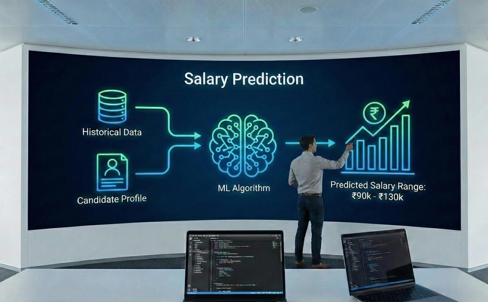
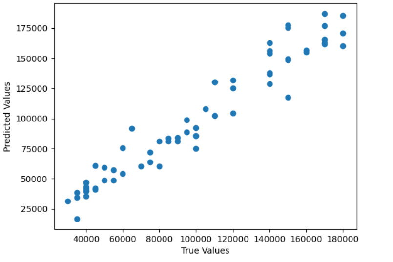

# Employee Salary Prediction using Machine Learning



## Description
Employee Salary Prediction is a machine learning project that predicts employee salaries using job-related data. The project compares two regression models—Linear Regression and XGBoost—using actual vs predicted salary visualizations.

---

## Models Used
- Linear Regression  
- XGBoost Regressor  

---

## Tech Stack
- Python  
- Pandas, NumPy  
- Scikit-learn  
- XGBoost  
- Matplotlib, Seaborn  

---

## Model Outputs

### 🔹 Linear Regression – Actual vs Predicted Salary


### 🔹 XGBoost Regressor – Actual vs Predicted Salary


---

## How to Run

### 1️.Clone the Repository
```bash
git clone https://github.com/aryan-pandey00/Employee-Salary-Prediction.git
cd Employee-Salary-Prediction
```
### 2.Install Dependencies
```bash
pip install -r requirements.txt
```
### 3.Run the Project
- Open the Jupyter Notebook
- Ensure Salary Data.csv path is correct
- Run all cells
